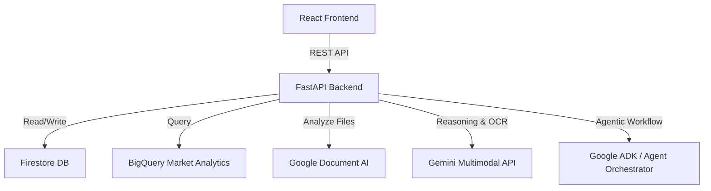
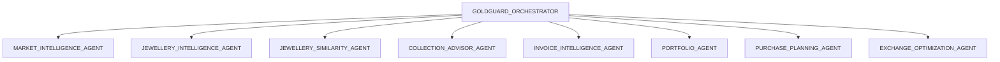

# GoldGuard Architecture Document

This document outlines the software architecture, agentic design, data flow, and Google Cloud services integrated into GoldGuard.

## System Architecture

GoldGuard follows a decoupled Client-Server architecture:
1. **Frontend (Vite + React + TypeScript)**: Responsive, modern UI styled with Tailwind CSS, utilizing Recharts for data visualization, and Lucide React for consistent UI iconography.
2. **Backend (FastAPI + Python)**: Exposes typed REST API endpoints, orchestrates AI agents, performs deterministic financial calculations, and interfaces with Google Cloud services (Firestore, BigQuery, Google Document AI, Gemini API).

---

## Agentic Architecture

To provide explainable, domain-specific insights, GoldGuard uses a **Multi-Agent Architecture** coordinated by a central orchestrator.

### Agent Roles & Functions

1. **`GOLDGUARD_ORCHESTRATOR`**: Coordinates sub-agents to construct the unified, explainable "Personalized Gold Purchase Plan".
2. **`INVOICE_INTELLIGENCE_AGENT`**: Extracts and validates structured invoice details (purity, weight, jeweller, fees) using Gemini/Document AI.
3. **`PORTFOLIO_AGENT`**: Aggregates weight, purity distributions, estimated values, and manages portfolio data.
4. **`COLLECTION_ADVISOR_AGENT`**: Analyzes the portfolio to identify gaps (e.g. traditional vs contemporary, category imbalances) and recommends 3-5 next purchases.
5. **`JEWELLERY_INTELLIGENCE_AGENT`**: Analyzes desired jewellery images using Gemini to estimate category, style, weight ranges, and purity options.
6. **`JEWELLERY_SIMILARITY_AGENT`**: Evaluates similarity between target designs and existing pieces, returning a percentage and structural reasons.
7. **`MARKET_INTELLIGENCE_AGENT`**: Evaluates historical prices from BigQuery to compute moving averages, volatility, percentiles, and market scenarios.
8. **`EXCHANGE_OPTIMIZATION_AGENT`**: Performs trade-in/sell analyses of existing assets to offset purchase costs.
9. **`PURCHASE_PLANNING_AGENT`**: Computes savings requirements, funding gaps, and monthly/weekly milestones under different timelines.

---

## Google Cloud Services Integration

- **Google Cloud Run**: Runs the backend FastAPI container, which serves the compiled React static files.
- **Firebase Authentication**: Secures client endpoints and registers user accounts.
- **Cloud Firestore**: Stores personal portfolios, purchase goals, and user settings.
- **BigQuery**: Hosts historical market prices for analytical queries (e.g. daily, weekly, monthly moving averages, volatility percentiles).
- **Gemini Multimodal API**: Powers image and document understanding for invoices and designs.
- **Google Document AI**: Parses invoices when structured OCR parsing is preferred.

---

## Demo Mode

To allow judges to evaluate the app immediately without cloud credentials, a global `DEMO_MODE=true` is implemented:
- **Data Source**: Replaces BigQuery with local parses of `data/gold_prices.csv`.
- **Invoices/Portfolios**: Loads from `data/synthetic_user_portfolios.csv` and `data/synthetic_invoices.csv`.
- **Gemini & Agents**: Uses high-fidelity local mocked responses simulating full multi-agent logic, including structured JSON logs of agent thinking and execution.
- The UI will explicitly display labels such as `[Simulated]`, `[Estimated]`, or `[AI Estimate]` to ensure transparency.
