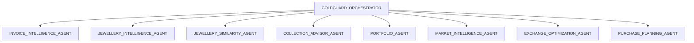

# GoldGuard Multi-Agent System Design

GoldGuard uses a modular, role-based multi-agent architecture to orchestrate structured, explainable AI responses.

## Agent System Map

## Agent Workflows

### 1. Invoice Extraction Flow
- **User Uploads Invoice** -> `INVOICE_INTELLIGENCE_AGENT` extracts text/image details -> Returns structured JSON.
- If fields are missing, they are marked `null` to ensure data integrity.

### 2. Collection Advisory Flow
- **Dashboard Load** -> `PORTFOLIO_AGENT` aggregates assets -> `COLLECTION_ADVISOR_AGENT` performs Gap Analysis against the portfolio -> Compares with `jewellery_catalog.csv` -> Returns 3-5 recommendations + "Avoid Duplication" flags.

### 3. Purchase Planning Flow
- **Target Item Selected** -> `JEWELLERY_INTELLIGENCE_AGENT` (image features) -> `JEWELLERY_SIMILARITY_AGENT` (portfolio match) -> `MARKET_INTELLIGENCE_AGENT` (scenarios) -> `EXCHANGE_OPTIMIZATION_AGENT` (trade-ins) -> `PURCHASE_PLANNING_AGENT` (weekly/monthly savings) -> `GOLDGUARD_ORCHESTRATOR` compile -> **Final Gold Purchase Plan**.
